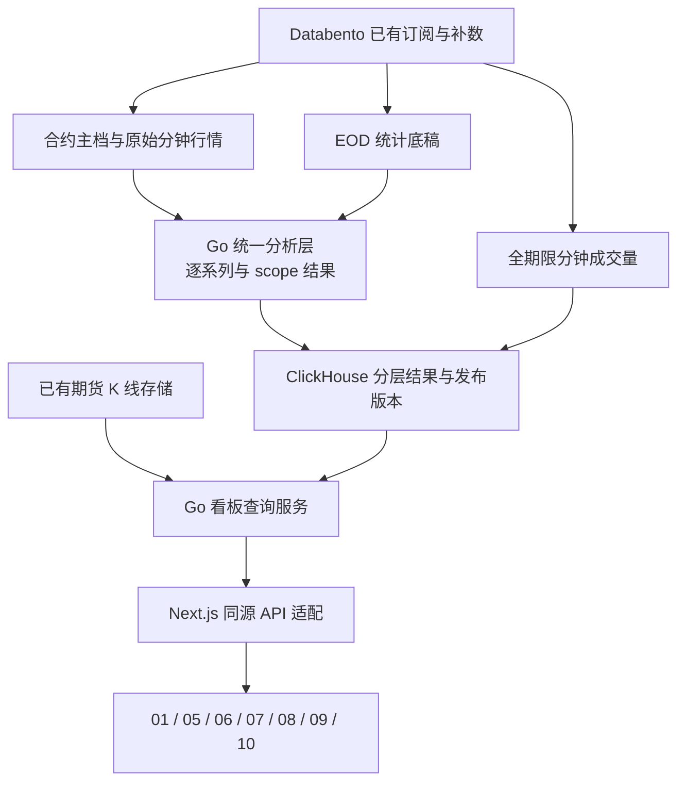

# Go 期权 API 对接与改进方案

日期：2026-09-04。状态：**需求与源码对照完成，方案待实施**。

> **2026-09-10 实施状态注记（后补，务必先读）**
>
> 本方案的主体**已经实施**：前端已切到 `OPTIONS_API_MODE=unified`，五个读接口全部走 Go 服务，线上后端自报 `source: "databento-go"`。
>
> - **没有采用** 本文 §5 建议的 `/options/v2/*` 版本化路径 —— 实际直接用了无版本前缀的 `/options/*`（`status`、`dashboard`、`levels`、`intraday`、`underlying-bars`、`chain`、`term`、`0dte-volume-profile`）。
> - **接口清单、字段结构、实测体积与耗时、已知问题** 一律以 **[`../interface/Go后端接口清单.md`](../interface/Go后端接口清单.md)** 为准；本文保留为设计推演与验收标准的依据。
> - 本文 §1 的"线上验证限制"（`app.marsoon.cn` 返回 HTML 而非 JSON）**已解除**：真实 API 域名是 `.env.local` 里的 `OPTIONS_API_BASE_URL`，实测返回 JSON。
> - §3.6 列的演示/替代数据路径（local-demo、平铺历史、调试 VP、0DTE 冒名回退）：`unified` 模式下已不再作为正常路径；本仓原有的本地采集链路已于 2026-09-10 整体删除（见 `../interface/Go后端接口清单.md` §10）。
> - §8 要求的"文档同步修正"大部分已在本轮完成；`quality_flags` 的位定义仍缺后端权威说明。
>
> 下文为 2026-09-04 原文，除本注记外未作改动。

前端：`/Users/mima0000/Desktop/Marsoon-Option-main`。
Go 后端：`/Users/mima0000/Desktop/github/trading-platform-main`。

本文以当前代码为依据，历史文档仅作需求参考。此次为只读评估：未修改业务代码、后端配置或数据库，未向任何行情写入接口 POST 数据。

## 1. 结论与核验边界

建议保留现有 Go Databento Worker、Black-76 引擎与 ClickHouse 数据体系，在其上增加面向看板的查询契约和缺失的数据层。Next.js 保留同源 `/api/options/*` 适配层，负责代理、字段归一化及错误处理；**正式数据只经 Go 侧计算，不在本仓任何层重算 Greeks**。

当前不能直接替换 API 地址就满足前端。主要差距是：

1. 五档周期与采集范围不匹配：前端 `close/0dte/d30/d90/all`，Go 公开查询只有 `0dte/nearest/all`，采集期限默认 20 天、可配置上限 45 天。
2. Go 有行情与分析基础，但没有完整 chain、term、underlying-bars、看板刷新状态接口。
3. 全期限逐档成交量、最后成交、Theta/Vega、前结算价、EOD 底稿需要补齐；有的源数据已订阅，有的仍需新增持久化。
4. Go 的跨到期汇总目前不计算 Gamma Flip/Expected Move；前端不能用单到期值冒充聚合值。
5. 前端存在演示回退、调试 VP、历史平铺与字段含义不一致，必须同时修正。

**线上验证限制**：本次只读访问文档中的 `https://app.marsoon.cn/options/dashboard`，分别带 NQ、`scope=0dte/d90`、`days=1&window_pct=0.02`，均得到 HTTP 200 的 Marsoon HTML 页面，未得到 JSON。这只能证明本次入口没有返回目标 API；不能据此认定 Go 数据库无数据或已经部署当前源码。正式联调前需核实真实 API 域名/代理规则/部署版本。仓库 Caddyfile 中的代理配置也不能证明线上实际配置。

本机接口实测（当时）：`dashboard` 返回本地合成数据、33 个 cells；`levels` 返回本地合成数据；`intraday` 返回 `has_data=false`、空 bars/levels。因此无本地数据源时并非所有面板都会空态；此前启动说明中的这一表述需要更正。（2026-09-10 起本仓已无任何本地数据源，该演示分支不再启用。）

## 2. 各面板需求与后端覆盖

| 面板 | 当前前端消费 | Go 已有能力 | 必须补齐/调整 |
|---|---|---|---|
| 01 总览 | dashboard.summary、market_state、关键位、ATM IV、EM、OI PCR、0DTE GEX 占比 | `/options/dashboard` 基本结构相近，已有 GEX/墙/状态/到期汇总 | 五 scope、完整覆盖标记、同版本占比、跨到期 Flip/EM/ATM IV 的明确口径；不能将可见窗口当全链 |
| 05 到期热力图 | 到期×执行价 C/P GEX/OI；列 CW/PW/FLIP；多周期关键位；05→08/09 下钻 | heatmap.cells、surface levels、多到期投影 | ≥90D/真正全期限；周期过滤与显示期限分开；系列/标的键；直接用服务端列级关键位，停止在裁剪矩阵上重算 |
| 06 日内变化 | 同标的 OHLCV、各 scope 的历史墙/Flip/IV/EM、current；右侧 GEX VP | `/options/levels` 有真实时序；通用 `GetCandles` 与 WS candles 已有 | 增加 REST bars/intraday 组合、真实 GEX VP、CME 交易日回放；历史 ATM IV/EM 字段与跨到期结果补齐 |
| 07 微笑偏斜 | 逐执行价 C/P IV、ATM IV，多周期叠加 | heatmap 有 call_iv/put_iv | 按到期/系列返回曲线；不能把不同期限 IV 简单平均后称为同一微笑；提供报价时间和质量 |
| 08 GEX 拆分 | 按执行价 C/P/net GEX/OI/volume + 主 scope 关键位 | heatmap 可供 GEX/OI 基础显示 | 真正的 scope 聚合 strike profile，成交量，跨标的聚合规则；不能继续依赖单个 MarketState 的标的过滤 |
| 09 期权链 | 系列清单、单系列 call/put 报价、Last、IV、Greeks、OI、日累计量、涨跌幅、Max Pain | definitions、OI、StrikeMetric 中部分报价/IV/Delta/Gamma 已有 | 新 chain API；原始报价独立于分析门槛存储；Last、Theta/Vega、累计量、前结算价、系列唯一键、可空 Greeks |
| 10 月间价差/PCR | 每到期 ATM IV、官方 IV、量 PCR/OI PCR、前后两期限 IV spread、BCR | 单到期 IV/OI 可以组合；方向流与 0DTE strike volume 有基础 | 新 term API、全期限量、明确 PCR/BCR 公式与覆盖；官方 IV 无源时 null，不能把自算值改名官方 |
| 全站数据状态 | 前端曾以本地采集状态字段变化触发查询失效 | 当前八个 API 没有等价状态协议 | 新 source-neutral status，按 product/scope/数据域输出 revision、更新时间和空态原因（前端侧已先用 `/api/options/version` 落地，见 `../frontend/本地侧优化方案.md` L1） |

说明：06 的 VP 当前代码含义是 GEX 剖面，不是传统按价格累计的期货成交量 Profile。接入时保持这一含义，不能因名称 VP 就换成另一类数据。

09 的正确统一方式是“scope 决定可选系列范围、当前 tab 决定具体合约链”。不同到期的 bid/ask/last 不能相加成一条可交易链；08 的 GEX 则可以在定义清楚标的与模型后聚合。这两类统一不应被实现成相同的算术聚合。

## 3. 已确认的关键问题

### 3.1 周期与覆盖

- Go `types.go` 与 HTTP handlers 只支持 `0dte/nearest/all`；`d30/d90/close` 在当前源码中会被拒绝。
- Worker 默认 `ExpirationHorizon=20d`，环境变量与 dashboard/heatmap 的 `days` 都限制最多 45。不能把 `days=90` 当作现成方案。
- 当前 `all` 是“已发现并已计算的到期范围”，不是交易所全部上市合约；计算时还可能跳过尚未准备好 OI/标的报价的到期。
- 前端 dashboard fetcher固定发送 `days=20`，且当前本地 route 实际输出全部 perSerie cells。接到会执行 days 限制的 Go API 后，同一界面会突然缩成 20 天。
- 前端 0DTE 无匹配时退到最近到期，d30/d90 空集合也退到第一条；0DTE 只取第一条匹配系列。正式接入必须禁止这种冒名回退，并纳入当日全部适用系列。

建议 scope 定义：

| key | 定义 | 输出目标频率 |
|---|---|---|
| close | 上一份已发布的 EOD 全期限核算版本；带明确交易日与发布状态 | 日频，修订另发 revision |
| 0dte | 该 CME 交易日到期、且 asof 时未失效的系列集合 | 1 分钟完成桶 |
| d30 | 未过期且到期日期与交易日期相差 0～30 个日历日的系列集合 | 先复用现有 5 分钟 surface，按负荷可调整至 15 分钟 |
| d90 | 同上，0～90 个日历日 | 同上 |
| all | 已发现的全部有效上市系列；若覆盖不足，显式 partial | 15～60 分钟目标，按完整性发布 |

`all` 在 UI 显示 RTH 只是现有命名，不能据此将其解释为“只统计美国常规交易时段”。`scope` 是到期范围，`session` 是交易时段，应分别定义。旧 `nearest` 保留供旧客户端使用，不能静默改成 d90。

### 3.2 原始行情不能受 GEX 计算门槛控制

Go 的 `StrikeMetric` 已有 C/P bid、ask、mid、IV、gamma、delta，且已写入 ClickHouse。但 `Calculator.Calculate` 只有通过 OI 下限、价差、陈旧性、IV 反解等检查之后才赋这些报价字段。默认 OI 下限是 10。

所以“数据库有 bid/ask 列”不代表已具备完整期权链：低 OI/宽价差/无法反解 IV 的合约，真实报价仍应显示；其分析值可以为空。新 chain 应以 definition 为骨架左连接独立行情快照，再连接分析结果，不能只投影现有合格 GEX 行。

建议新增按合约存储的分钟行情表，保留 C/P 的真实存在性和各字段有效性。原表合并 C/P，质量旗标也是合并的，难以可靠区分“某一侧缺 OI”和“该侧 OI 真为零”。新增层要补侧别有效性，不把旧表默认零全部解释成真值。

### 3.3 价位字段直接映射会出错

Go `PriceLevel.level` 是价位；`value` 是该指标数值/强度。前端 `levels-view-model.ts` 当前用 `strike ?? value` 取价位，且类型没有 `level`。直接透传 Go 响应会把 GEX 等数值误当价格。

适配规则：`Go.level → 前端 strike`，保留原 `value` 作强度；或者前端契约统一改读 `level`。两者选定一种实施，禁止对 Go payload 保留 `value` 兜底取价位。`zero_gamma` 可在适配层规范为 `gamma_flip`，并按 metric/rank 去重。

### 3.4 快照不一致与缺失值

- Go dashboard 是多个 reader 的组合，不是原子快照；summary 的 state 与逐档最新 heatmap 可能不是同一分钟。
- heatmap 查询回看 7 天、逐字段 `argMax`；Nullable 字段需复核其聚合语义，避免最新无效 IV 被旧非空 IV 填回，时间却标成最新。
- heatmap SQL 按 product/expiration/strike 分组，将 underlying 作为 argMax 值；不同期货合约/系列碰到同到期同执行价可能混合。新层必须保留唯一系列与标的维度。
- Go dashboard 的 expiries 和 `visible_*` 来自裁剪窗口；不能无标记地当完整到期 OI/PCR/TERM Σ。
- 前端 heatmap/视图层把缺 volume/OI `?? 0`，接旧 Go cells（没有 volume）后会把未提供的成交量显示为 0。
- 前端 chain 的 `snapshot_unix` 当前取响应时刻，不是数据版本，需改为真实快照/修订版本。
- Go QualityMissingUnderlying 的位值 1 与本地 `ivFallback ? 1 : 0` 含义不同，不能混用质量位。增加 `quality_schema`，使用逐字段/逐侧状态。

### 3.5 Gamma Flip、IV 与 Expected Move

Go `AggregateInventory` 明确只做现有库存聚合，未产生组合 Flip/EM。不能平均各到期 Flip，也不能取任一到期 Flip 当 d30/d90/all 结果。

建议在 Worker 分析阶段复用各合约场景输入，对 scope 内组合重算净 Gamma 曲线，求零点；无穿越返回 null + 原因。跨标的期货月份需要约定共同参考轴：例如以参考期货价格 S 做相同比例冲击，逐合约使用 `F_j(S)=F_j0×S/F_ref0`，这是**待版本化的模型假设**，不是交易所字段。实际 strike 列保留其本身含义；不同 underlying 的链/微笑默认分组，不未经说明合并报价或将墙位投影到参考轴。

05 当前在已裁剪的行权价矩阵中做 net GEX 的相邻符号插值并标为 FLIP，和“改变标的价格后重算整链净 Gamma 的零点”不是同一指标。改读服务端 expiry levels；若保留原算法，必须另命名，不与 Gamma Flip 共用标签。

多期限 IV 不可简单等权混成一条微笑。首期建议 scope 筛选到期集合、每个系列单独返回 IV 曲线；若未来需要 30/90 天恒定期限曲线，应新增独立插值模型/方法标识。

聚合 scope 的 ATM IV/EM 也要定义参考到期或固定预测期限，明确 `iv_method`、`reference_expiration`、`em_horizon_seconds`。不能把不同到期 EM 相加、拿某列值冒充聚合值；未定义前保持 null，此项完成后才可称总览指标完整覆盖。

### 3.6 前端存在演示/替代数据路径

必须在正式数据模式下修复：

1. dashboard 无真实分析时生成动态 `local-demo`。
2. levels 无数据时生成演示历史；有数据时把当前值平铺到全部历史时间点。
3. 06 wrapper 直接调用 `buildDebugGexBreakdownModel` 生成 VP，即使已有真实 spot 也使用调试剖面。
4. 0DTE/期限空集回退到别的到期。

演示能力如需保留，只放明确进入的独立演示页面；正常数据模式无数据必须显示空态/缺口。06 的日内数据走 Go `/options/intraday`，与旧 levels 路由不是同一路径，不能把旧 levels 的历史平铺问题误说成 intraday 一定使用假历史。

## 4. 建议的分层架构

### 4.1 复用的部分

- Databento 合约发现、标的 mbp-1、期权 bbo-1m、trades、statistics 订阅。
- 现有 Black-76、OI asof、报价质量判断、CME 交易日/夏令时逻辑。
- 现有 definitions、OI、strike metrics、price levels、market states、hedge flow 等表与旧八个 REST API。
- 现有期货 `GetCandles` 和 WS 通路。新增 REST 包装优先调用同一 reader，不另建重复 K 线系统。

### 4.2 新增或扩展的数据层（均为建议，尚未创建）

| 层 | 建议新增内容 | 作用 |
|---|---|---|
| 合约/系列主档 | 稳定 `series_id`、具体 raw_symbol、underlying、到期时刻、类型、乘数/跳动、定义版本、有效期/删除状态 | 单系列下钻、跨月归属、历史 EOD 主档重建；不要仅按 expiration 选链 |
| `option_contract_quotes_1m` | 原始 bid/ask/size、last/last_trade_unix、OI 及 source/reference、字段有效性、报价版本 | 完整报价展示与分析门槛解耦；无报价也保留合约骨架 |
| 合约分析扩展层 | nullable IV/Delta/Gamma/Theta/Vega/GEX、pricing_model、参数版本、质量原因 | 09 明细、07 微笑；优先在既有计算批次内复用中间量 |
| `option_trade_volume_1m` | 全期限按合约/系列/执行价的 C/P Buy/Sell/Unknown 合约量、成交笔数、覆盖状态 | 09 日累计量、10 PCR/BCR、08 volume；与旧 0DTE 表并存迁移 |
| `option_eod_statistics` | settlement、preliminary/final、actual/theoretical、OI、reference/source/published_at、修订版本 | close、前结算价/涨跌幅、历史回放 |
| scope 聚合结果 | d30/d90/all/close 的完整元数据、关键位、strike profile、可选 term 派生指标 | 01/05/06/08 多周期一致性 |
| snapshot 发布清单 | product、scope、数据域、版本、组件覆盖和完成标记 | 状态 API、原子可见版本、补数修订、部分失败识别 |

旧 Store/Reader 的调用关系保持兼容；新读能力优先独立窄接口，例如 ChainReader、TermReader、UnderlyingBarsReader、SnapshotStatusReader。需要修改 Worker 的地方按独立迁移批次实施，新增表/列不改旧字段含义。

分钟成交量只存一分钟增量，日累计按交易日汇总/增量缓存。重连回放要去重，修订要替换对应分钟版本；中午启动只收到两分钟 replay 时，不能称作“当日总成交量”，必须补齐交易日起点或显示 partial。旧 0DTE 表可做读视图/投影保持兼容，避免双路径独立计数造成漂移。

### 4.3 分频与发布

数据频率和 API 查询频率分开：不能仅把 API 轮询改成 15 分钟，就声称已经降低全期限订阅流量。先扩展合约发现范围，测量真实订阅数量、处理时延和覆盖，再选择分组流式订阅/历史增量补数方案。

每个完成周期先写数据组件、再写发布清单；读服务只读取已发布版本。不同 scope 可有不同频率，但每个响应必须注明其版本与各组件 observed 时间。跨 scope 占比需要使用共同可比的 asof；未对齐则空值或明确 partial，不能将新 0DTE 除以过旧 all。

查询只读预计算结果和有界时段，不触发全链计算；热点结果按 product/scope/revision/显示范围缓存，合并同键并发。dashboard 最新状态查询应从“每请求回扫七天分钟行”收敛到最新已发布版本或最新行索引。矩阵分页/裁剪在汇总之后，裁剪不改变 scope 总量。

## 5. 目标 API 与适配规则

以下是**拟新增的版本化 API**，不是目前已经存在的路由。建议放 `/options/v2/*`，旧八接口保持可用；Next.js 的五个业务路由继续作为浏览器入口。选择版本化是因为 scope、空值、系列键和快照语义都有实质变化。

| 拟定 Go API | 参数要点 | 服务内容 |
|---|---|---|
| `GET /options/v2/status` | products、可选 scopes | 按 product/scope/domain 的版本、新鲜度、覆盖、错误原因 |
| `GET /options/v2/dashboard` | product、scope、asof/revision、显示期限/strike 窗口 | 总览、完整 scope 汇总、到期摘要、显示窗口 cells、scope strike profile |
| `GET /options/v2/levels` | product、scope、underlying、from、to、timeframe | 真历史关键位/状态，包含可用的历史 ATM IV/EM |
| `GET /options/v2/underlying-bars` | product、underlying、from、to、timeframe | 同价轴期货 OHLCV、final、缺口和来源 |
| `GET /options/v2/intraday` | product、scope、underlying、交易日或 from/to | 组合 bars + levels + current；底层复用上述读服务 |
| `GET /options/v2/chain` | product、scope、series_id、asof/revision、行权价分页 | 可选系列目录、选中单系列 C/P 完整链；参数越界不得静默换系列 |
| `GET /options/v2/term` | product、scope、asof/revision、volume_basis | 每系列/到期 ATM IV、PCR、IV spread、定义明确的 BCR |

09 若需要独立轻量目录，可将 series catalog 从 chain 拆出；首期无需为了接口数量另做一套服务。07 先由 chain/expiry 曲线供数，避免每次下载全矩阵。

通用响应元数据建议包括：`schema_version`、`source`、`pricing_model`、`model_version`、`quality_schema`、`product`、`scope`、`underlying_symbol`、`trading_date`、`snapshot_unix`、`revision`、`generated_at`、`has_data`、`data_status`、`missing_reason`、`coverage`。

`data_status` 区分 ready/partial/stale/empty；`coverage` 至少含预期/已采集/可计算合约或系列数、期限边界、报价/OI/成交量覆盖状态、observed 时间范围。没有完整主档时不报告“100%覆盖”。`has_data=true` 不等于全部字段齐全。

关键字段映射：

| 输入/现状 | 目标处理 |
|---|---|
| Go PriceLevel.level | 适配为前端 strike，保留 value 为指标强度 |
| Go heatmap.cells | 前端读取 dashboard.heatmap.cells；不能读取顶层 cells |
| Go net_delta_notional/net_charm_notional | 保留单位化命名；旧 expiry.delta/charm 如仍需兼容，必须确认显示含义后显式映射 |
| `balanced_gamma` | 映射前端 neutral；当前 normalizeRegime 没有正确覆盖该枚举 |
| Go candle open/high/low/close | 映射前端 o/h/l/c |
| Go candle vbuy/vsell/vunknown | 前端 v = 三者之和，不遗漏 Unknown |
| Go 秒级 unix | 接口保留秒；仅浏览器 Date/旧 capturedAt 兼容位置乘 1000 |
| call_vol/put_vol | 明确 session cumulative 或 minute increment；不在同一字段下静默切换 |
| 缺失 Greeks/报价/OI | null；前端 OptionsChainSide 的必填 number 及 toFixed 格式化必须支持 null |
| 非 JSON/HTTP 错误 | 显示服务错误，不转换成“零数据”或演示行情 |

**BBO 分钟时间对齐需专项修复验证**：官方 `bbo-1m.ts_recv` 是区间结束边界；当前 Worker 将它直接当普通报价时间，并以 `< bucket_end` 过滤，可能把正好属于上一分钟的 BBO 排除、造成一桶滞后。应区分 interval_end 与普通事件时间，按 schema 对齐逻辑，使用边界样例验证。不要对 mbp-1/trades 统一减一分钟。[Databento BBO 官方说明](https://databento.com/docs/schemas-and-data-formats/bbo)

现有 Candle reader 范围查询使用 `<= to`。新增 REST 契约统一 `[from,to)` 时必须在读层/适配层处理上界，避免分段加载重复末根；旧 WS 契约保持原样。

### 5.1 09 字段口径

- `last` 来自真实最新成交，并带成交时间；不能用 mid/settlement 静默替代。bbo-1m 本身也带 last-sale 信息，当前 handler 仅转 top-of-book，可评估复用并保留其真实 last 时间；日总量仍不能用 BBO 的单笔 size 代替。
- 当前 CHG% 提示写的是“较昨日结算价”，而类型名 prev_close 写“昨收”。建议新增 `prev_settlement` 与 `change_basis=previous_settlement`，旧字段仅作明确映射，公式 `(last-prev_settlement)/prev_settlement`，基准缺失/为零则 null。
- Theta 保持每年原值、Vega 保持每 1.00 IV 原值；前端继续分别 ÷365、÷100。单位是报价点还是美元也应独立标明，避免再次乘合约乘数。
- Max Pain 可在 Go 按完整单系列 OI 预计算并标明算法版本；这是派生指标，不要求等待供应商直接交付。OI 覆盖不足时空值/partial。
- `iv_fallback` 不能把所有缺 IV 都等同为“使用了 ATM 回退”。建议以 observed/calculated/fallback/unavailable 表达方法与可用性。

### 5.2 10 与 EOD

PCR volume = 同一交易日、同一系列集合的 put 成交合约量 / call 成交合约量；OI PCR 使用同一有效 OI 截面的 put/call。分母为零或覆盖不足时按约定返回 null/partial。不要把 hedge-flow 的成交笔数 `buy_trades/sell_trades` 当合约数量。

BCR 在现有文档里只写了 Buy/Sell 拆分，尚未给出唯一公式。建议 API 先提供原始 buy/sell/unknown 数量与 coverage；UI 明确采用 Buy/Sell ratio 或 Buy/(Buy+Sell) 后再命名显示，不把两者混称。Unknown 计入总量，不纳入方向性分子/分母，并显示未知占比。

Databento 官方 statistics 表显示 GLBX.MDP3 有结算价与 OI，但没有 stat_type 14/15（结算 IV/Delta），也没有该表的 close/net-change 11/12。故不能承诺直接取得“官方 IV/昨收涨跌”；期权价格输入下的 Black-76 自算继续放 Go，`iv_official` 无源时 null。[Databento Statistics 官方字段及数据集覆盖](https://databento.com/docs/schemas-and-data-formats/statistics)

EOD 需要基于 stats 的 reference/source、final/preliminary、actual/theoretical 与修订语义选值，不能把最后一条盘中 snapshot 标成 close，也不能假定 settlement 和 OI 在同一时刻发布。close 未完成前保留空态；上一有效版本可显示但必须标明交易日与陈旧状态。发布后修订用新 revision，历史 asof 不读取当时尚未发布的更正。

## 6. 前端改动范围

1. `src/api/options.ts`：新来源契约、可空数字、series_id、level 映射、版本与 coverage；删掉 days=20 的隐含期限约束。
2. `src/app/api/options/*`：改为 Go 适配/只读组合；**只允许 Go 一个数据来源**，不在请求中混合两套引擎结果。
3. 数据版本与查询 hooks：消费 `/api/options/version`（Go 派生的 `(product, scope, unix)`）；版本变化只失效相关查询的活跃项。**已落地**（`src/features/options/data-freshness.ts`）。
4. `dashboard-view-model.ts`：nullable volume/OI、balanced_gamma、明确 scope profiles、系列/标的维度，不继续用 state.underlying 过滤掉跨月聚合数据。
5. `expiration-heatmap-model.ts`：列级关键位改消费后端；series identity 与 scope/显示窗口过滤分离；不在截断数组上计算全链统计。
6. `panel-wrappers.tsx`：06 VP 接真实 scope profile；08 直接消费聚合 profile；09 将 scope 带到查询/catalog，冻结时同时冻结品种与 scope 选择。
7. `OptionsChainPanel.tsx`：nullable Greeks/CHG、系列唯一键、真实 source/时间提示。保持单系列报价含义。
8. 07/10：曲线带系列/参考到期/方法；官方 IV 无源时隐藏对应线，PCR 与 IV 图例使用实际来源。

此阶段不改 Dockview 布局、06 四栏几何、徽标 LOD、主题、侧栏或渲染交互。数据范围变化可能带来不同点数，应验证但不顺手重做 UI。

## 7. 实施顺序与验收门槛

| 阶段 | 实施内容 | 完成条件 |
|---|---|---|
| P0-A 入口与真实性 | 核实 API 域名/代理；明确 schema；移除正常模式 demo、假历史、调试 VP；修 level/空值/质量位；接 status | 无数据三个品种都诚实空态；正常 API 返回 JSON；上游失败能区分；同版本不重复刷 |
| P0-B 基础可用链路 | 复用现有 dashboard/levels；增加 bars 与 intraday；实现可用 0DTE GEX/IV/OI；Next 适配与来源切换 | 01/05/06/07/08 在已覆盖范围真实显示；未支持 scope 明确空态，不能宣称五档完成 |
| P0-C 完整链与成交量 | 原始报价层、chain、Theta/Vega/Last；全期限成交量与补数；term PCR/IV/BCR | 09 所需字段按可用性返回，低 OI 合约报价保留；10 的比率与独立汇总一致；成交重放不翻倍 |
| P1-A 五周期完整覆盖 | 扩期限发现/订阅/存储；d30/d90 聚合、全期限覆盖声明；组合 Flip/IV/EM 模型；07/08/09 统一 | 0DTE⊆30D⊆90D⊆all 的合约集合正确；边界/多系列/跨标的测试通过；裁剪不改变总量 |
| P1-B 收盘及历史完整性 | EOD stats/主档 asof/快照修订；前结算价/CHG；Max Pain；跨天回放/补数 | close 为真实已发布 EOD；历史不前视；缺结算不补 0；≥5 交易日 bars 先验收，60日/两年回填另分批验收 |
| P2 性能与迁移收尾 | 最新快照索引/缓存、有界分页、跨scope复用、旧来源退役、监控 | 多窗口稳定；scope 总量与裁剪无关；既有 Go API/WS 数据回归不受破坏 |

P0 阶段只代表真实数据主链跑通；**满足全部前端要求需完成 P1-A 和 P1-B**。可以分批上线，但每批明确哪些周期/字段仍空缺。

建议实现时的验收场景：

- 字段：Go `level` 不得被当成 value；真实零与缺失分开；C/P 无对应合约时 side=null；Greeks 显示单位准确。
- 周期：无当日到期、同日多系列、DTE=30/31/90/91、跨 Chicago 换日/夏令时、节假日/提前收市；当前日历只有周末与固定换日逻辑，特殊日历需补证。
- 价格轴：NQ/ES/GC 与实际 underlying 对齐；请求某 underlying 无数据不得默默换另一合约；raw_symbol 年码不通过简单字符串截断替换。
- 时间：BBO 区间结束边界、已完成桶、期权/期货时间戳定义、historical asof、同桶修订、`[from,to)` 分段无重叠。
- 统计：分钟成交量求和含 Unknown；重连/补数不重计；OI 不跨分钟相加；方向流不能代替库存 Delta；PCR 不能平均各档比率。
- 模型：组合 Flip 用场景重算，非平均或执行价插值；不同期限 IV 不偷换；基础 gamma 不因 Put 为负，负号属于本项目 signed GEX 约定，Charm/Theta 符号按公式原值保留。
- 一致性：summary/expiry/profile 版本可追溯，修改显示范围不改变 scope 总量；部分写入不发布完成版本；有数据但低质量不冒充完整覆盖。
- 性能：记录同一快照开启 1 窗/多窗的请求数、DB 读取行数、CPU、响应体与 p95；同键并发合并，后续增量不重扫原始历史。
- 回归：前端 tsc；Go 新增 reader/handler/calculator 的针对性测试；既有 options 与 candles/volumes 路径保持旧契约。只有接口+浏览器实际显示通过，才称接入完成。

## 8. 文档需同步修正的内容

- `Databento数据源需求.md` C1 写 `[T+30,T+120]`，与现行 d90 的 DTE≤90 不一致；同步五档，不继承旧 L3/L4 编号。
- 数据源迁移章节说“只换采集层、消费契约不变”，不足以涵盖此次 Go 接入的 scope/series/null/版本差异，应改成版本化适配方案。
- `供应商数据需求.md` P0-3 仍有“最近到期”措辞，且 volume 分钟/累计两种口径并存；以面板明确的 volume_basis 为准。
- “Put 侧方向指标全部负值”过宽。Put Delta 与本项目 signed Put GEX 按约定处理；Gamma/Vega 等基础 Greeks 不加人为负号，Charm 不保证恒负。
- 10 面板"官方 PCR/IV"与 Go 自算来源要重新标注，标签只能反映 Go 侧口径。
- 06 调试 VP、正常模式 local-demo、levels 历史平铺、0DTE 回退等与 AGENTS 的无模拟数据要求不符，修正后再更新面板状态。
- API 文档的服务地址需用真实 JSON 请求验证后更新；本次未确认替代域名。

## 9. 主要源码证据

以下路径均在本次重新读取，结论并非仅来自历史记忆。

| 证据 | 源码位置 |
|---|---|
| 前端五周期与全量接口类型 | [options.ts](/Users/mima0000/Desktop/Marsoon-Option-main/src/api/options.ts:1) |
| 前端模拟 dashboard 回退 | [dashboard route](/Users/mima0000/Desktop/Marsoon-Option-main/src/app/api/options/dashboard/route.ts:360) |
| 当前值平铺历史/演示 levels | [levels route](/Users/mima0000/Desktop/Marsoon-Option-main/src/app/api/options/levels/route.ts:109) |
| 空周期回退最近系列 | 服务端聚合层（本仓对应本地模块已删除） |
| 06 调试 VP | [panel-wrappers](/Users/mima0000/Desktop/Marsoon-Option-main/src/features/board/panel-wrappers.tsx:290) |
| 05 的执行价插值 Flip | [expiration-heatmap-model](/Users/mima0000/Desktop/Marsoon-Option-main/src/features/board/expiration-heatmap-model.ts:76) |
| 前端价位字段误配风险 | [levels-view-model](/Users/mima0000/Desktop/Marsoon-Option-main/src/features/options/levels-view-model.ts:35) |
| 版本刷新的现行实现 | `src/features/options/data-freshness.ts` |
| Go 八条真实注册路由 | [server.go](/Users/mima0000/Desktop/github/trading-platform-main/actor/server/server.go:207) |
| Go dashboard scope/days 校验及组合读取 | [options_dashboard.go](/Users/mima0000/Desktop/github/trading-platform-main/actor/server/options_dashboard.go:100) |
| Go 类型/质量位/报价和 Greeks | [types.go](/Users/mima0000/Desktop/github/trading-platform-main/pkg/options/types.go:8) |
| 采集范围默认与上限 | [worker.go](/Users/mima0000/Desktop/github/trading-platform-main/pkg/options/worker.go:86) |
| 已有 BBO/trades/statistics 订阅 | [worker.go](/Users/mima0000/Desktop/github/trading-platform-main/pkg/options/worker.go:615) |
| 成交量目前只保留 0DTE 逐档 | [worker.go](/Users/mima0000/Desktop/github/trading-platform-main/pkg/options/worker.go:805) |
| statistics handler 当前只收 OI | [worker.go](/Users/mima0000/Desktop/github/trading-platform-main/pkg/options/worker.go:1035) |
| 计算门槛影响报价持久化 | [calculator.go](/Users/mima0000/Desktop/github/trading-platform-main/pkg/options/calculator.go:66) |
| 跨到期不计算 Flip/EM | [calculator.go](/Users/mima0000/Desktop/github/trading-platform-main/pkg/options/calculator.go:448) |
| 逐档七天最新投影及分组键 | [ClickHouse options.go](/Users/mima0000/Desktop/github/trading-platform-main/pkg/db/clickhouse/options.go:644) |
| Candle 全部成交量字段 | [event.go](/Users/mima0000/Desktop/github/trading-platform-main/event/event.go:181) |
| 复用 K 线 reader | [clickhouse.go](/Users/mima0000/Desktop/github/trading-platform-main/pkg/db/clickhouse/clickhouse.go:960) |
| 当前 CME 日期逻辑 | [trading_date.go](/Users/mima0000/Desktop/github/trading-platform-main/pkg/options/trading_date.go:20) |

